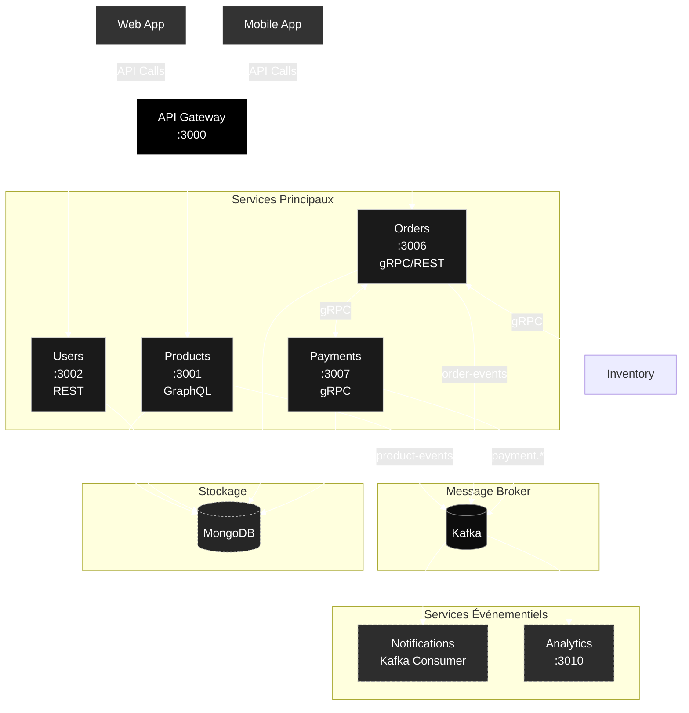
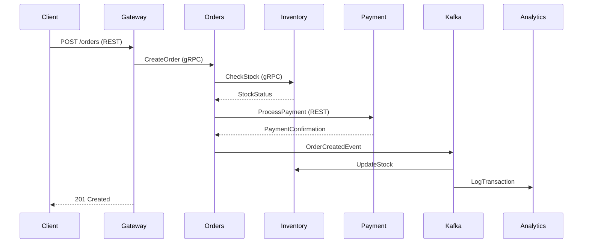

# 🛍️ E-commerce Microservices Platform

**Une plateforme e-commerce hautement scalable** construite avec une architecture microservices moderne, permettant une évolution indépendante des composants et une résilience accrue.

## 🌟 Fonctionnalités Principales

- ✅ Architecture 100% microservices avec isolation des données
- ✅ Multi-protocols (REST, GraphQL, gRPC) selon les besoins
- ✅ Communication asynchrone via Kafka

## 🏗 Architecture du Système

### Diagramme d'Architecture Global



### 🔄 Flux Typique de Commande


## 🛠 Stack Technique Complète

🛠 Stack Technique Complète
📚 Langages & Frameworks
<div style="display: flex; flex-wrap: wrap; gap: 10px; margin-bottom: 15px;">     </div>
🗃 Bases de Données & Infrastructure
<div style="display: flex; flex-wrap: wrap; gap: 10px;">    </div>

## 📡 Matrice des Services

| Service               | Port  | Protocol | Base de Données | Dependencies           | Endpoints Clés                     |
|-----------------------|-------|----------|-----------------|------------------------|------------------------------------|
| 🚪 API Gateway        | 3000  | REST     | -               | Users, Products        | `POST /auth`, `GET /products`      |
| 📦 Products Service   | 3001  | GraphQL  | MongoDB         | -                      | `query { products }`               |
| 👥 Users Service      | 3002  | REST     | MongoDB         | -                      | `POST /users`, `GET /users/{id}`   |
| 🛒 Orders Service     | 3006  | gRPC     | MongoDB         | Payment, Inventory      | `CreateOrder`, `GetOrderStatus`    |
| 💳 Payment Service    | 3007  | gRPC     | MongoDB         | -                      | `ProcessPayment`, `GetPayment`     |
| 📦 Inventory Service  | 3008  | gRPC     | MongoDB         | -                      | `CheckStock`, `UpdateInventory`    |
| 🔔 Notification Svc   | 3009  | Kafka    | -               | -                      | `order_created`, `payment_processed` |
| 📊 Analytics Service  | 3010  | REST     | MongoDB         | Kafka                  | `GET /metrics`, `POST /events`     |
## 🚀 Démarrage Rapide

### Explication des Protocoles

1. **API Gateway**
   - Utilise REST pour les communications externes
   - Point d'entrée unique pour toutes les requêtes

2. **Products Service**
   - Utilise GraphQL pour les requêtes flexibles
   - Publie des événements sur Kafka
   - Cache Redis pour les performances

3. **Orders Service**
   - Utilise gRPC pour la communication inter-services
   - Vérifie les stocks via gRPC
   - Publie des événements sur Kafka

4. **Users Service**
   - Utilise REST pour la gestion des utilisateurs
   - Gestion de l'authentification
   - Publie des événements sur Kafka

5. **Payment Service**
   - Utilise REST pour les APIs externes
   - Intégration avec les passerelles de paiement
   - Publie des événements sur Kafka

6. **Notification Service**
   - Consomme des événements Kafka
   - Gère les notifications en temps réel
   - Utilise REST pour les emails

7. **Inventory Service**
   - Utilise gRPC pour la communication avec Orders
   - Gestion des stocks en temps réel
   - Publie des événements sur Kafka

### Flux de Communication

1. **Client → API Gateway**
   - Communication REST
   - Authentification et autorisation
   - Routeur vers les services appropriés

2. **Service → Service**
   - gRPC pour la communication haute performance
   - Kafka pour les événements asynchrones
   - Cache Redis pour les données fréquentes

3. **Service → Base de données**
   - Chaque service a sa propre base de données
   - Isolation des données
   - Optimisation des performances

4. **Service → API Externe**
   - REST pour les services externes
   - Intégration des passerelles de paiement
   - Services tiers

## Technology Stack

- **Node.js** for all microservices
- **Express.js** for building RESTful APIs
- **Kafka** for event streaming and message brokering
- **gRPC** for inter-service communication
- **MongoDB** as the main database
- **Docker** for containerization
- **Docker Compose** for container orchestration
- **Zookeeper** for distributed service coordination

## 🚀 Services

### Services Principaux
- **Products Service** (`3001`) - Gestion des produits et du catalogue
- **Users Service** (`3002`) - Authentification et gestion des utilisateurs
- **Orders Service** (`3006`) - Gestion des commandes
- **Payment Service** (`3007`) - Traitement des paiements (gRPC sur le port `50052`)
- **Notification Service** (`3008`) - Envoi de notifications
- **Analytics Service** (`3010`) - Analyse des données

### Infrastructure
- **Kafka** - Messagerie asynchrone entre les services
- **MongoDB** - Base de données principale
- **Zookeeper** - Coordination des services distribués

## 🛠 Prérequis

- Docker et Docker Compose
- Node.js 16+
- npm ou yarn

## 🚀 Démarrage Rapide

1. **Cloner le dépôt**
   ```bash
   git clone [URL_DU_REPO]
   cd ecommerce-microservices
   ```

2. **Démarrer les services**
   ```bash
   docker-compose up -d
   ```

3. **Vérifier les services**
   ```bash
   docker-compose ps
   ```

## 📡 Points de Terminaison

### REST API
* **Produits**: `http://localhost:3001/api/products`
* **Utilisateurs**: `http://localhost:3002/api/users`
* **Commandes**: `http://localhost:3006/api/orders`
* **Paiements**: `http://localhost:3007/api/payments`

### GraphQL
* **Playground**: `http://localhost:3001/graphql`
* **Users Service**: `http://localhost:3002/graphql`

### gRPC
* **Payment Service**: `localhost:50052`

## Testing

### Running Tests

Run unit tests for all services:
```bash
npm test
```

### Health Check Endpoints

- API Gateway: `http://localhost:3000/health`
- Products Service: `http://localhost:3001/health`
- Users Service: `http://localhost:3002/health`
- Orders Service: `http://localhost:3006/health`
- Payment Service: `http://localhost:3007/health`
- Inventory Service: `http://localhost:3008/health`
- Analytics Service: `http://localhost:3010/health`

## CI/CD

The project includes GitHub Actions workflows for:
- Automated testing on pull requests
- Docker image building and pushing to Docker Hub
- Deployment to staging/production environments
  
 ## Auteurs
 Rania MRAD


